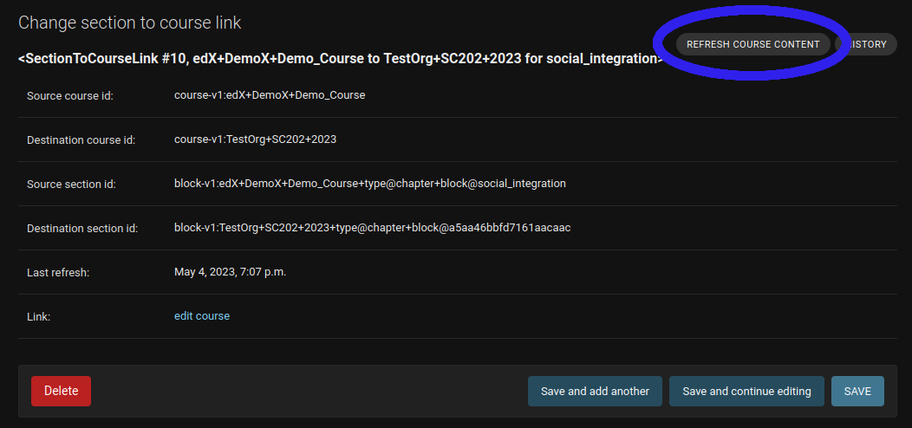

section-to-course
#############################

|license-badge| |status-badge|

Purpose
*******

Allows course authors to factor sections from Open edX courses into their own new course.

License
*******

The code in this repository is licensed under the AGPL 3.0.

Please see `LICENSE.txt <LICENSE.txt>`_ for details.

Contributing
************

Contributions are very welcome.

This project is currently accepting all types of contributions, bug fixes,
security fixes, maintenance work, or new features.  However, please make sure
to have a discussion about your new feature idea with the maintainers prior to
beginning development to maximize the chances of your change being accepted.
You can start a conversation by creating a new issue on this repo summarizing
your idea.

Reporting Security Issues
*************************

Please do not report security issues in public. Please email help@opencraft.com.

.. |license-badge| image:: https://img.shields.io/github/license/open-craft/section-to-course.svg
    :target: https://github.com/open-craft/section-to-course/blob/main/LICENSE.txt
    :alt: License

.. |status-badge| image:: https://img.shields.io/badge/Status-Experimental-yellow

Installation
************

This application is not yet available on PyPI, so you will need to install it from source. You can install it from source on the current master branch by adding:

.. code-block:: bash

    git+https://github.com/open-craft/section-to-course.git

...to the ``requirements/private.txt`` file of your Open edX installation, and then run ``pip install -r requirements/private.txt``. If you're developing locally without the platform, create a virtualenv using the latest Python 3.8 release, and then run ``pip install -e .`` from the root of this repository.

Development
-----------

If developing on this application, you will need to install it as an editable package. To do so, follow these steps:

1. Set up the Open edX `devstack <https://github.com/openedx/devstack>`_ using the `nutmeg.master` version as explained in `this guide <https://edx.readthedocs.io/projects/open-edx-devstack/en/latest/developing_on_named_release_branches.html>`_.

Then, in the ``edx-platform`` repository root, run:

.. code-block:: bash

    git remote add open-craft git@github.com:open-craft/edx-platform.git
    git fetch open-craft
    git checkout open-craft/opencraft-release/nutmeg.2

2. Then, in the ``src`` directory of your devstack, run:

.. code-block:: bash

    git clone git@github.com:open-craft/section-to-course.git

Then, in your `devstack` directory, run:

.. code-block:: bash

    make dev.shell.studio
    cd /edx/src/section-to-course
    pip install -e .

Usage
*****

Once installed, the plugin should automatically register itself within Django. Be sure to run database migrations.

The admin views are in the Django admin, under the "Section to Course" section. From there, you can create a new section to course link, which will create a new course with the same content as the section you selected. You can also view the list of existing section to course links, refresh them, and delete them.

Refreshing a Course
-------------------

There are two ways to refresh a course:

1. Use the admin action from the changelist view. This will allow you to refresh several courses at once.
2. Use the refresh button on the detail view for a single course, shown here:

